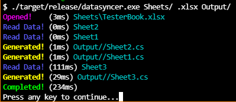

[](https://github.com/JustinMorritt/DataSyncer/actions/workflows/rust.yml)
[](https://github.com/JustinMorritt/DataSyncer/actions/workflows/Release.yml)
### Extensions supported ( .xls, .xlsx, .xlsm, .xlsb, .xla, .xlam, .ods )

### Speed Test


Image shows the results of 5000defs synced from 2 workbooks and 5 sheets. over 180,000 lines of c# generated

# How To Use
## Running it
1. Run the release exe from command line.
2. Pass in the required args  1(Sheets Folder) 2(Sheets Extension) 3(Output Folder)
3. Example: `datasyncer.exe Sheets .ods Output`
   1. `./target/release/datasyncer.exe Sheets/ .xlsx Output/`
4. Verbose/Debugging output: pass in fourth arg of `--verbose`
## Creating a Sheet
1. Right now just use the [TesterBook.xlsx](Sheets/TesterBook.xlsx) for reference as to how it will need to be structured as well as all the functionalities that are supported

# BUGS
- DO NOT USE degree SYMBOLS IN YOUR PARSED .CS files .. it does not parse those well will break swapping of the blocks
- PASSING IN PATHS WITH SPACES IN IT BREAKS CLI Args handling

# Todo
- [x] handle primitives and enums
- [x] handle lists of primitives and enums
- [x] handle class's on defs
- [x] minor cleanup pass / refactor
- [x] Code Cleanup - Break out some functions, handle all the unwraps. those are ugly and not handled correctly
- [x] Create Data dump first  C# file
- [x] Open up existing c# Output and slam over them with the new values
- [x] Support one excel workbook or a folder of them
- [x] add in --verbose if you want to see all the logs
- [x] Implement progress bars -> https://crates.io/crates/indicatif
- [x] Implement nicer CLI look -> https://docs.rs/console/0.10.0/console/
- [x] Show progress bar / stopwatch status how fast it exported
- [x] strip down the block start and ends (quicker)
- [x] add in generated getter function
- [x] global headers just a comment generated with a title and a space above
- [x] add in fix for varying lengths of lists on defs if nothing in the field don't add in another item
- [x] add in support for datetimes in defs and global
  - [ ] add in support for unix time, 
  - [ ] add in support for utc/local
- [x] implement global enums not the creation the actual value
- [x] fix stripping out whitespace on the CONST and all over the var names, this causes confusion when trying to import.
- [x] Implement vec 2, 3, 4    2.4|5.4|234
- [x] Multithread this .. work on 4 cores. .. basically parse through a sheet per thread.
- [NOT-POSSIBLE][x] Support Def Comments, Field Comments, Value Comments etc. insert these above values or above classes or to the side of a value
  - [NOT-POSSIBLE][x] Add in notes for the id .. after the id enum could have a comment note // Something about this id
- [x] fix the cur_list_index .. just redo this logic entirely very bad
- [ ] Add in better handling of the incoming command line args ..
  - [ ] don't care about ordering and handle test paths with spaces in them
- [ ] fix up the final strings for the data types
- [ ] Add in arrays of classes ???
- [ ] add in enabled def solution / getter function
- [ ] Add in dev options at the top of the sheet next to the sync ..
- [ ] make a bash script that after the build is successful copys the --release build over to brawlquest
- [ ] ? Implement Passing in if you want an enum array built or just straight up global_fields named nicely  
- [ ] ? Implement Passing in if you want it static
- [ ] Add in only importing the excel books that changed (need to generate some sort of last imported modification)
- [ ] FIX - EMPTY DEF SHEET, right now if you go from an empty def sheet to adding in defs to it they wont fill.. you have to delete the file
- [x] HANDLE inserting \ before " automatically in strings
- [x] HANDLE inserting "\n" in the string where it would be a straight up next line
- [ ] under the COUNT generated number have a FIRST {get{return defs[1]}} and LAST {get{return defs[COUNT]}}


# Using It In Unity
```c#
public static class EditorUtils
{

    [MenuItem("Enable/Run Data-Sync %#d", priority = -10000)] // ctrl + shift + d
    static void RunDataSyncer()
    {
        string root = GetRootDirectory();

        string extension = ".xlsx"; // Extensions supported (.xls, .xlsx, .xlsm, .xlsb, .xla, .xlam, .ods)
        string appendixPath = root + "Design/";
        string outputPath = root + "Assets/DataSynced"; // c# in unity
        string args = appendixPath + " " + extension + " " + outputPath;//  + " --verbose";

        if(!Directory.Exists(outputPath))
        {
            Directory.CreateDirectory(outputPath);
        }

        string exe = root + "Assets/DataSyncer/datasyncer.exe";
        var process = Process.Start(exe, args);
    }
}

```

### Benchmarking
```rust
    let start = Instant::now();
    println!("BENCH TEST ({}ms)", start.elapsed().as_millis());
```